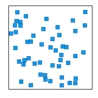
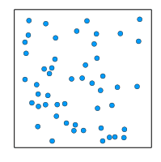
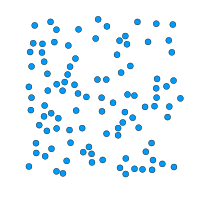

# Uchiyama.jl

This code is based on [Nathalie Ayi](https://www.ljll.math.upmc.fr/~ayi)'s work.

[Numerical Study of the Uchiyama particle model](https://www.ljll.math.upmc.fr/~ayi/publication/uchiyama_oberwolfach/)

